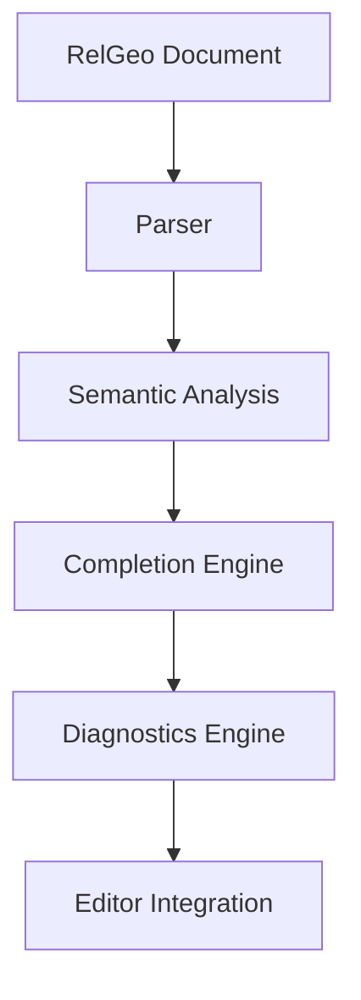

# RelGeo Language Service

Intelligence layer untuk DSL RelGeo.

Package ini mengikuti kontrak aktif `RelGeo DSL v0.5`, yang disajikan melalui website pada `/docs/language-spec/`.

Metadata package `relgeo-language-service` saat ini adalah `0.4.0`. Versi package library ini dikelola terpisah dari kontrak DSL `v0.5` dan tidak dengan sendirinya menyatakan adanya release registry.

Status packaging saat ini:

* package ini adalah library surface untuk editor intelligence
* jalur konsumsi yang paling sehat saat ini masih melalui monorepo workspace
* surface registry mandiri sebaiknya diperlakukan sebagai langkah packaging terpisah

Pakai package ini jika Anda ingin:

* menambahkan completion, diagnostics, atau schema ke editor RelGeo
* membangun IDE ringan, extension editor, atau embedding authoring surface
* menjaga editor tetap selaras dengan kontrak bahasa aktif

Jika yang Anda butuhkan berbeda:

* gunakan `relgeo-core` untuk runtime parse/resolve
* gunakan `relgeo-playground` bila Anda ingin aplikasi interaktif yang sudah jadi

`relgeo-language-service` menyediakan fitur editor pintar seperti auto-completion, diagnostics (linting), dan JSON Schema untuk dokumen RelGeo.

Package ini dirancang agar editor dapat memahami RelGeo sebagai sebuah **typed geometry language**, bukan sekadar YAML biasa.

Artinya, package ini tetap netral terhadap surface editor:

* bisa dipakai oleh browser IDE yang ringan
* bisa dipakai oleh workbench lokal yang lebih kaya
* tidak mendefinisikan preference UX salah satu surface

Dokumen terkait:

* kontrak bahasa aktif: `RelGeo DSL v0.5`, disajikan melalui website pada `/docs/language-spec/`
* dokumentasi publik dan contoh penggunaan: [relgeo.github.io](https://relgeo.github.io/)

---

# Philosophy

RelGeo sejak awal dirancang sebagai:

- relation-first
- deterministic
- geometry-aware
- completion-oriented

Karena itu, editor support bukan fitur tambahan opsional.

Language service diposisikan sebagai bagian penting dari pengalaman penggunaan RelGeo:

- membantu penulisan DSL
- menjaga validitas geometri
- memberikan semantic guidance
- membantu generasi kode oleh LLM
- menjaga struktur dokumen tetap konsisten

---

# Features

## Context-Aware Auto Completion

Completion engine memahami konteks YAML dan struktur semantik RelGeo.

Contoh kemampuan:

- object type suggestions
- field suggestions
- geometry query suggestions
- anchor suggestions
- placement suggestions
- transform suggestions
- path segment suggestions
- tangent/intersection helpers

Contoh:

```yaml
objects:
  panel:
    type: rect
    size: [120, 80]

  label:
    type: text
    place:
      centerX: panel.
```

Editor akan menyarankan:

```txt
centerX
centerY
left
right
top
bottom
center
```

---

## Geometry-Aware Diagnostics

Diagnostics tidak hanya memeriksa syntax YAML.

Language service juga menggunakan validator dari `relgeo-core` untuk mendeteksi:

- circular dependency
- invalid anchors
- over-constrained geometry
- under-constrained geometry
- invalid intersections
- invalid path closure
- invalid tangent construction
- invalid offset operations

Contoh error:

```txt
MULTIPLE_INTERSECTIONS
PATH_NOT_CLOSED
UNKNOWN_REFERENCE
CIRCULAR_DEPENDENCY
```

---

## JSON Schema

Package menyediakan JSON Schema bawaan untuk:

- VS Code YAML validation
- Monaco Editor
- CodeMirror integrations
- tooling eksternal

Schema selalu diarahkan agar sinkron dengan semantic contract dari `relgeo-core`.

---

## Typed Geometry Semantics

Language service memahami primitive dan semantic contract RelGeo:

- `point`
- `line`
- `rect`
- `circle`
- `arc`
- `quadratic`
- `cubic`
- `path`
- `polygon`
- `text`
- `group`
- `clone`

Termasuk:

- 9-point anchors
- query functions
- path holes
- fillet/chamfer
- tangent relations
- generalized intersection

---

## Editor Agnostic

Package tidak terikat pada editor tertentu.

Dapat digunakan pada:

- CodeMirror
- Monaco Editor
- VS Code Extension
- custom playground
- embedded browser editor

---

# Installation

Dalam monorepo ini:

```bash
pnpm install
```

Jika suatu saat package ini dipublikasikan terpisah, surface install-nya ditargetkan tetap berbentuk library integration package.

```bash
npm install relgeo-language-service
```

> [!IMPORTANT]
> Package ini membutuhkan `relgeo-core`.

---

# Architecture



---

# Basic Usage

```typescript
import { RelGeoLanguageService } from 'relgeo-language-service';

const langService = new RelGeoLanguageService();

const diagnostics = langService.getDiagnostics(code);

const completions = langService.getCompletions(code, {
  line: 10,
  character: 5,
});
```

---

# Integrating with CodeMirror 6

```typescript
import { RelGeoLanguageService } from 'relgeo-language-service';
import { linter } from '@codemirror/lint';
import { autocompletion } from '@codemirror/autocomplete';

const langService = new RelGeoLanguageService();

// Diagnostics
const relgeoLinter = linter((view) => {
  const code = view.state.doc.toString();

  const diagnostics = langService.getDiagnostics(code);

  return diagnostics.map((d) => ({
    from: 0,
    to: code.length,
    severity: 'error',
    message: d.message,
  }));
});

// Auto Completion
const relgeoAutocompletion = autocompletion({
  override: [
    (context) => {
      const code = context.state.doc.toString();
      const line = context.state.doc.lineAt(context.pos);

      const completions = langService.getCompletions(code, {
        line: line.number - 1,
        character: context.pos - line.from,
      });

      return {
        from: context.pos,
        options: completions.map((c) => ({
          label: c.label,
          type: 'keyword',
          detail: c.documentation as string,
        })),
      };
    },
  ],
});
```

---

# API Reference

## `RelGeoLanguageService`

Main service untuk diagnostics, completions, dan schema access.

---

## `getDiagnostics(code: string): Diagnostic[]`

Melakukan parsing dan validasi dokumen RelGeo.

Menghasilkan diagnostics yang kompatibel dengan pola LSP.

Contoh:

```typescript
const diagnostics = langService.getDiagnostics(code);
```

---

## `getCompletions(code, position): CompletionItem[]`

Menghasilkan daftar completion berdasarkan konteks YAML dan semantic geometry RelGeo.

Contoh:

```typescript
const completions = langService.getCompletions(code, {
  line: 12,
  character: 8,
});
```

---

## `getSchema()`

Menghasilkan JSON Schema RelGeo.

Contoh:

```typescript
const schema = langService.getSchema();
```

---

# Completion Categories

Completion engine saat ini mencakup:

- document structure
- scene fields
- parameter fields
- object types
- placement anchors
- geometry queries
- transform pipeline
- path segments
- text anchors
- metadata fields
- tangent construction
- offset semantics
- path holes

---

# Diagnostics Philosophy

Language service tidak mencoba memperbaiki geometri secara diam-diam.

RelGeo tetap mempertahankan prinsip:

```txt
validation-first
strict determinism
no hidden geometry mutation
```

Karena itu diagnostics diarahkan untuk:

- memberi feedback jelas
- menjaga intent desain
- membantu debugging geometry
- menjaga hasil tetap reproducible

---

# Relationship with relgeo-core

`relgeo-language-service` dibangun di atas semantic runtime dari `relgeo-core`.

Artinya:

- validator menggunakan semantic rules yang sama
- completion mengikuti contract geometry yang sama
- diagnostics mengikuti error model yang sama
- schema mengikuti primitive yang sama

Tujuannya adalah menjaga agar:

```txt
Editor behavior == Runtime behavior
```

---

# Current Scope

Saat ini language service fokus pada:

- completion
- diagnostics
- schema generation
- semantic validation

Belum mencakup:

- formatting
- refactoring
- symbol rename
- semantic navigation
- incremental parsing
- collaborative editing

---

# Roadmap

Arah pengembangan berikutnya:

- semantic hover information
- dependency graph inspection
- inline geometry preview
- anchor visualization
- symbol navigation
- semantic rename
- incremental diagnostics
- LSP server resmi

---

# Related Packages

- `relgeo-core` → typed geometry runtime
- `relgeo-language-service` → editor intelligence layer
- `relgeo-cli` → command line tooling
- `relgeo-playground` → lightweight browser IDE
- `relgeo_flutter` → richer local workbench

---

# License

MIT
